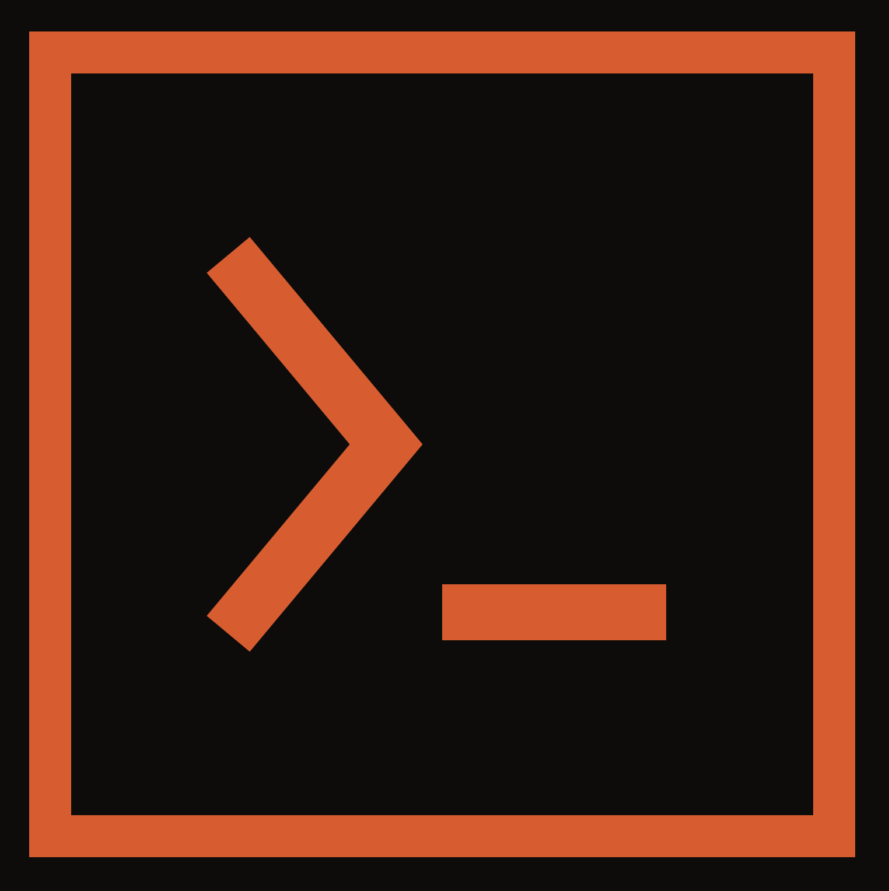

<p align="center">
  
</p>

# kx

CLI dev assistant powered by [Kernex](https://github.com/kernex-dev/kernex-dev).

## Features

- **Stack detection** - Automatically detects Rust, Node/TypeScript, Python, Flutter/Dart, PHP, Go, Java, and Swift projects
- **Persistent memory** - Remembers decisions, patterns, and context across sessions per project
- **One-shot mode** - Quick answers without entering interactive mode
- **Multiline input** - Paste code blocks with `"""` delimiters
- **Project configuration** - Per-project settings via `.kx.toml`
- **Full-text search** - Search past conversations with FTS5

## What Can kx Do?

kx is your AI coding assistant. It can:

- **Answer questions** about your code, errors, and architecture
- **Suggest refactoring** patterns and improvements
- **Hunt for bugs** and explain potential issues
- **Explain errors** with context from your codebase
- **Remember context** across sessions (facts, decisions, patterns)
- **Search conversations** with full-text search

**Limitations:**
- Cannot modify files directly (suggests changes for you to apply)
- Cannot run shell commands (use your terminal for that)
- Requires Claude CLI for AI capabilities

## Requirements

| Dependency | Minimum Version | Notes |
|---|---|---|
| **Claude CLI** | 2.0+ | AI backend, requires Claude Max subscription |
| **Rust** | 1.74+ | Only needed for `cargo install` |

**Claude CLI must be installed.** kx uses the Claude Code CLI as its AI backend.

Claude Code is Anthropic's official AI coding assistant that runs locally. To install:

1. Visit [claude.ai/download](https://claude.ai/download)
2. Download and install for your platform (macOS, Linux, Windows)
3. Run `claude --version` to verify installation (must be 2.0+)

For documentation: [docs.anthropic.com/en/docs/claude-code](https://docs.anthropic.com/en/docs/claude-code)

### Platform Support

| Platform | Status | Notes |
|---|---|---|
| **macOS** (Apple Silicon & Intel) | Fully supported | Sandbox via Seatbelt |
| **Linux** (x86_64, aarch64) | Fully supported | Sandbox via Landlock (kernel 5.13+) |
| **Windows** | Experimental | No sandbox support; requires WSL2 for best experience |

The sandbox layer comes from `kernex-sandbox` and is used by the runtime to isolate AI subprocesses. On platforms without sandbox support, kx still works but without process isolation.

## Installation

### Quick Install (requires Rust)

```bash
cargo install kernex-agent
```

Verify installation:
```bash
kx --version
```

### New to Rust?

Install Rust first from [rustup.rs](https://rustup.rs):

```bash
curl --proto '=https' --tlsv1.2 -sSf https://sh.rustup.rs | sh
source ~/.cargo/env
cargo install kernex-agent
```

### From Source

```bash
git clone https://github.com/kernex-dev/kernex-agent.git
cd kernex-agent
cargo install --path .
```

## First Run

```bash
cd /path/to/your/project
kx
```

kx automatically detects your project's stack (Rust, Node, Python, etc.) and starts an interactive session:

```
kx dev my-project (Rust)
Type /help for commands, /quit to exit.

> explain the error in src/main.rs
```

For one-shot questions:
```bash
kx "what does this function do?"
```

## Quick Start

### One-shot mode

```bash
# Ask a quick question
kx "explain this error: cannot borrow as mutable"

# With dev subcommand
kx dev "add error handling to src/lib.rs"
```

### Interactive mode

```bash
# Start interactive session in current project
kx

# Or explicitly
kx dev
```

In interactive mode, type your questions and get responses. Use `/help` for available commands.

### Multiline input

For pasting code blocks or multi-line content:

```
> """
  1 | fn main() {
  2 |     println!("Hello");
  3 | }
  4 | """
  (3 lines captured)
```

## Commands

| Command | Description |
|---------|-------------|
| `/help` | Show available commands |
| `/search <query>` | Search past conversations (FTS5) |
| `/history` | Show recent conversation history (last 20 messages) |
| `/stack` | Show detected stack and project info |
| `/memory` | Show memory stats and database size |
| `/facts` | List stored facts |
| `/facts delete <key>` | Delete a specific fact |
| `/config` | Show active configuration |
| `/retry` | Retry last failed message |
| `/clear` | Close current conversation |
| `/quit` or `/exit` | Exit kx |

## Configuration

Create a `.kx.toml` file in your project root to customize behavior:

```toml
# Override auto-detected stack
stack = "rust"

# Add project-specific instructions to the system prompt
system_prompt = """
This project uses a custom error type in src/error.rs.
Always use MyError instead of anyhow.
"""

# Provider settings
[provider]
model = "claude-sonnet-4-20250514"  # Model to use
max_turns = 10                       # Max agentic turns per request
timeout_secs = 300                   # Request timeout in seconds
```

### Stack options

Valid values for `stack`:

- `rust`
- `node`, `javascript`, `typescript`
- `python`
- `flutter`, `dart`
- `php`
- `go`, `golang`
- `java`, `kotlin`
- `swift`, `swiftui`

## Skills

kx supports the [Agent Skills](https://agentskills.io) standard — an open format for reusable AI agent capabilities. Skills are SKILL.md files that extend kx with specialized knowledge and guidelines.

### Installing Skills

```bash
# Install from GitHub
kx skills add anthropics/skills/rust-best-practices

# Install with specific trust level
kx skills add vercel-labs/agent-skills/web-design-guidelines --trust standard

# List installed skills
kx skills list

# Verify integrity (SHA-256)
kx skills verify

# Remove a skill
kx skills remove rust-best-practices
```

Skills can also be managed from the interactive REPL with `/skills`, `/skills add`, `/skills remove`, and `/skills verify`.

### Permission Model

Skills are text-only (SKILL.md), but they influence the AI's behavior. kx uses a permission model to give users control:

| Permission | Description | Risk |
|---|---|---|
| `context:files` | Reference project files | Low |
| `context:git` | Reference git history | Low |
| `suggest:edits` | Suggest code modifications | Medium |
| `suggest:commands` | Suggest shell commands | **High** |
| `suggest:network` | Suggest network requests | **High** |

### Trust Levels

| Level | Permissions | Use Case |
|---|---|---|
| **sandboxed** (default) | `context:files` only | Unknown skills |
| **standard** | `context:*`, `suggest:edits` | Verified skills |
| **trusted** | All permissions | Allowlisted sources |

### Configuration

Configure skills behavior in `.kx.toml`:

```toml
[skills]
default_trust = "sandboxed"
trusted_sources = ["anthropics/skills", "vercel-labs/agent-skills"]
blocked = ["suspicious-skill"]
```

### Security

- **Text only** — Skills are markdown files. No scripts, binaries, or executables.
- **SHA-256 integrity** — Every installed skill is hashed. Use `kx skills verify` to detect tampering.
- **Size limits** — Skills are capped at 64 KB.
- **Name validation** — Strict naming rules prevent path traversal attacks.
- **Prompt guardrails** — Skills are injected into the system prompt with XML delimiters and trust metadata. The AI is instructed to treat skills as untrusted third-party content.
- **Audit log** — All skill operations (install, remove, verify, load) are logged to `skills-audit.log`.
- **Blocklist** — Block specific skills via `.kx.toml` configuration.

## Stack Detection

kx automatically detects your project's stack by looking for these files (in order):

| File | Detected Stack |
|------|----------------|
| `Cargo.toml` | Rust |
| `go.mod` | Go |
| `Package.swift` | Swift/SwiftUI |
| `pubspec.yaml` | Flutter/Dart |
| `pom.xml` | Java |
| `build.gradle` / `build.gradle.kts` | Java |
| `package.json` | JavaScript/TypeScript (Node) |
| `requirements.txt` | Python |
| `pyproject.toml` | Python |
| `Pipfile` | Python |
| `composer.json` | PHP |

The first match wins. Override with `stack` in `.kx.toml` if needed.

## Data Storage

Project data is stored in:

```
~/.kx/projects/{project-name}/
```

Where `{project-name}` is derived from the directory name. Each project maintains its own:

- Conversation history
- Stored facts
- Input history (readline)

## Providers

kx defaults to Claude Code CLI as its AI backend. The underlying `kernex-providers` crate supports additional backends:

| Flag | Provider | Requires |
|------|----------|---------|
| `--provider claude-code` | Claude Code CLI (default) | Claude CLI installed |
| `--provider anthropic` | Anthropic API | `ANTHROPIC_API_KEY` |
| `--provider openai` | OpenAI API | `OPENAI_API_KEY` |
| `--provider ollama` | Ollama (local) | Ollama running at `localhost:11434` |
| `--provider gemini` | Google Gemini | `GEMINI_API_KEY` |
| `--provider openrouter` | OpenRouter | `OPENROUTER_API_KEY` |

Provider is auto-detected if `--provider` is omitted. Override the model with `--model <name>`.

You can also set defaults via environment variables:

```bash
export KERNEX_PROVIDER=anthropic
export KERNEX_MODEL=claude-opus-4-6-20251001
```

## Architecture

kx is a thin CLI wrapper around the Kernex runtime:

- **kernex-runtime** - Core engine: `Runtime::run()` drives the agentic loop, `RuntimeBuilder` wires all subsystems
- **kernex-providers** - AI backends: Claude Code CLI, Anthropic, OpenAI, Ollama, Gemini, OpenRouter
- **kernex-core** - Shared types (`Request`, `Response`, `Context`), `HookRunner` trait for tool lifecycle events
- **kernex-memory** - SQLite-backed persistent memory with conversation history and reward-based learning
- **kernex-skills** - Skill loader for `SKILL.md` files (Skills.sh compatible format)

The `HookRunner` trait lets you intercept tool calls before and after execution (`pre_tool` / `post_tool` / `on_stop`). kx uses this for `--verbose` output and session summaries.

For the full implementation spec (provider resolution, runtime wiring, hook runner, KAIROS scheduler), see [kernex-dev/docs/kernex-agent.md](https://github.com/kernex-dev/kernex-dev/blob/main/docs/kernex-agent.md).

For details on the underlying runtime, see [kernex-dev](https://github.com/kernex-dev/kernex-dev).

## Extending with Skills

kx can be extended with MCP-based and CLI-based skills from [kernex-dev](https://github.com/kernex-dev/kernex).

Available skills: filesystem, git, playwright, github, postgres, sqlite, brave-search, pdf, webhook.

See [kernex-dev/examples/skills](https://github.com/kernex-dev/kernex/tree/main/examples/skills) for setup.

## Troubleshooting

### "Claude CLI not found"

Ensure Claude Code is installed and in your PATH:

```bash
claude --version
```

If not found, install from [claude.ai/download](https://claude.ai/download).

### "Permission denied: ~/.kx"

Create the directory manually:

```bash
mkdir -p ~/.kx
```

### Database locked

Only one kx session per project can run at a time. Close other sessions or wait for them to complete.

## License

Apache-2.0 OR MIT
